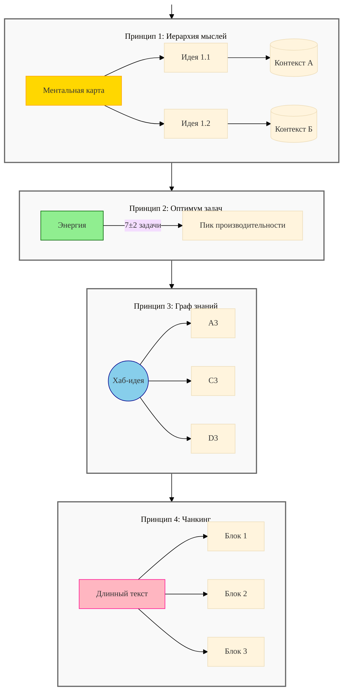
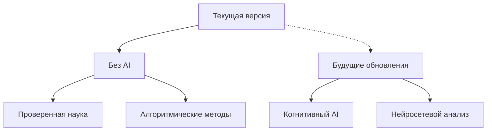

# LeonidPro
- Пет-проект для изучения возможностей Telegram-ботов. [leonid.pro](https://leonid.pro/) — продукт, [leonid.pro/bot](https://leonid.pro/bot) — бот @LeonidBot.

- Бот должен включать в себя различные полезные утилиты (таск-система, тайм-менеджер, интеграции с календарями, напоминалки, управление TG-группами)
- Для усложнения задачи поставил себе цель прикрутить веб-морду с авторизацией через Telegram.
- В качестве веб морды буду использовать Flask/FastApi/Django.
- В дальнейшем в проект будет внедрён NexusCore Balance и HabitMinder ранее являющиеся отдельными проектами.

## Брендинг
- Инструкции по фирменному стилю и использованию логотипов: [docs/agents.md](docs/agents.md)

## Структура проекта
- `bot/` – Telegram-бот и его обработчики
- `web/` – веб-приложение и связанные утилиты
- `core/` – общие модули (`db.py`, `models.py`, `services/`)

## Правила разработки
- `/core` содержит общие модели, сервисы, утилиты и логирование;
- `/bot` хранит только код Telegram-бота (хендлеры, FSM-состояния, роутинг aiogram);
- `/web` содержит только FastAPI-роуты, шаблоны и зависимости;
- новую общую бизнес-логику нужно выносить в `/core`, чтобы переиспользовать её в боте и веб-интерфейсе.

## Журнал изменений и планы
### Текущий статус
- Реализованы базовые команды Telegram-бота: работа с контактными данными, группами и логированием.
- Сервисный слой и тесты для задач, напоминаний, заметок, календаря и тайм-трекера.
- Веб-приложение с авторизацией через Telegram.
- В разработке: команды бота и веб‑роуты для задач, напоминаний, заметок, календаря и учёта времени; система рассылки напоминаний; миграции БД.

### Последние реализованные изменения
- [x] Асинхронный бэкенд на aiogram и SQLAlchemy с подключением к PostgreSQL.
- [x] Определены модели пользователей, групп, каналов и настроек логирования.
- [x] Сервис `UserService` для работы с пользователями, группами и логированием.
- [x] Команды `/start`, `/cancel`, `/birthday`, `/contact` для взаимодействия с пользователем.
- [x] Реализованы команды `/setfullname`, `/setemail`, `/setphone`, `/setbirthday` и редактирование описаний групп.
- [x] Команда `/group` для управления группами и декоратор проверки членства.
- [x] Логирование событий: middleware, пересылка неизвестных сообщений в группу логов, ответы админа, команды `/setloglevel` и `/getloglevel`.
- [x] Декоратор `role_required` для проверки ролей пользователей.
- [x] Заготовка FSM для обновления контактных данных и описания групп.
- [x] Каркас веб-приложения на FastAPI для работы через webhook.
- [x] Каркас таск-системы.
- [x] Добавлен каркас тайм-менеджера: модель `TimeEntry` и сервис `TimeService` для учёта затраченного времени.
- [x] Интеграция тайм‑трекера: веб‑API (`/time`), страница `web/static/ui/time.html`, команды бота `/time_start`, `/time_stop`, `/time_list`.
- [x] Подготовлено окружение: установлены зависимости, тесты (22 шт.) проходят; запуск веб-приложения падает из-за отсутствия PostgreSQL.
- [x] Добавлен каркас таск-системы: модель `Task` и сервис `TaskService` для создания и получения задач.
- [x] Унифицирована работа с паролями через обёртку `core.db.bcrypt` и сервис `WebUserService`.
- [x] Переведён `LogLevel` на числовой `IntEnum`, что исправило сравнение уровней логирования и потребовало обновления обработчика `/setloglevel`.
- [x] Добавлен пропущенный импорт `AsyncSession` в сервис Telegram-пользователей и устранены замечания `flake8` в модулях `core`.
- [x] Обновлён `AGENTS.md`: уточнены инструкции и добавлено требование фиксировать изменения и планы в `README.md`.
- [x] Переписаны шаблонные ответы во `web/routes` с учётом нового API Starlette `TemplateResponse`, что устранило предупреждения и проблемы с авторизацией/регистрацией.
- [x] Все обращения к `datetime.utcnow()` заменены на функцию `utcnow()` с поддержкой `datetime.UTC`, что устранило предупреждения о наивных датах.
- [x] Функция `utcnow()` теперь возвращает наивное UTC-время, что предотвращает ошибки `asyncpg` при работе с `TIMESTAMP WITHOUT TIME ZONE`.
- [x] Перейдено на lifespan-события FastAPI вместо устаревшего `@app.on_event`.
- [x] В тестах заменён параметр `allow_redirects` на `follow_redirects` для совместимости с новым API `TestClient`.
- [x] Перечисление `GroupType` дополнено типом `group`, что устраняет сбои при обработке обычных чатов Telegram в боте.
- [x] В `AGENTS.md` добавлены инструкции по обязательному запуску PostgreSQL перед тестами и использованию временного файла `.env.test`; `.env.test` внесён в `.gitignore`.
- [x] Добавлены статусы задач (`TaskStatus`) и поддержка в `TaskService`.
- [x] Каркас системы напоминаний: модель `Reminder` и `ReminderService`.
- [x] Добавлена привязка напоминаний к задачам через `task_id` и метод `add_reminder` в `TaskService`.
- [x] Расширена модель `Task` (когнитивная стоимость, приоритет, повторения) и добавлены модели `Area`, `Project`, `Habit`, `Resource`, `Archive`, `TaskCheckpoint`, `ScheduleException`, `OKR`, `KeyResult`, `Interface`, `Limit`, `Role`, `Perm`, `UserRole` и `Link` с базовыми сервисами.
- [x] Исправлена авторизация через Telegram: создаётся `TgUser`, проверяется наличие `WebUser`, устанавливаются нужные cookies и добавлены тесты.
- [x] Каркас работы с календарём: модель `CalendarEvent` и сервис `CalendarService`.
- [x] Каркас системы заметок: модель `Note` и `NoteService`.
- [x] Каркас модуля заметок.
- [x] Дашборд показывает профиль пользователя и его группы и проекты.
- [x] Дашборд оформлен с grid-layout: карточка профиля и сетка данных.
 - [x] Улучшено оформление карточек дашборда: ограничена ширина профиля и добавлены границы для секций данных.
 - [x] Все столбцы `DateTime` теперь хранят значения с часовым поясом (`timezone=True`), что предотвращает ошибки смешения naive/aware.
- [x] Исправлена команда `/birthday`, дата рождения берётся из `bot_settings`, что устранило `AttributeError`.
- [x] Добавлены методы совместимости Flask-Login в `WebUser` (`is_authenticated`, `is_active`, `is_anonymous`, `get_id`, `check_password`).
- [x] Команда `/birthday` показывает количество дней до события, запрашивая дату только при её отсутствии.
- [x] Таблицы пользователей переименованы в `users_tg` и `users_web`, правило префикса `users_` зафиксировано в `AGENTS.md`.
- [x] Автоматическое создание пользователя `test` со случайным паролем и отправкой данных в Telegram‑группу логов.
- [x] Поддержка привязки нескольких Telegram‑аккаунтов к одному веб‑пользователю через таблицу связей.
- [x] Сообщения из группы логов выполняются с правами администратора, и бот уведомляет о своих перезапусках в ту же группу.
- [x] Веб-каркас для задач, напоминаний, заметок, календарных событий и тайм-трекинга.
- [x] В шаблоне авторизации подключена опциональная загрузка reCAPTCHA и SVG-иконки.
- [x] Исправлено отображение главной страницы: неавторизованные видят форму входа, авторизованным доступен дашборд с меню по ролям.
- [x] Добавлена библиотека виджетов: универсальная карточка, KPI, списки, заглушки для графиков и таймлайн со стилями.
- [x] Профильное меню открывается по клику и закрывается при клике вне его; добавлен режим компактного дашборда с сохранением настроек в `localStorage`.
- [x] Дашборд получает безопасные плейсхолдеры KPI и таймлайна.
- [x] Дашборд расширен: таймлайн «Сегодня» перемещён под профиль, добавлены виджеты фокуса, задач, напоминаний, событий и привычек.
- [x] Добавлена отдельная страница заглушки `ban.html` для заблокированных пользователей.
- [x] В админ‑панели объединены привязка и отвязка Telegram‑аккаунтов в одном столбце и отображаются username вместо ID.
- [x] Зафиксированы правила нейминга LeonidPro и @LeonidBot в `docs/agents.md`.
- [x] Добавлен лендинг бота @LeonidBot и маршрут `/bot`.
- [x] Добавлен раздел Branding в `.env.example` с переменными `APP_BRAND_NAME`, `WEB_PUBLIC_URL`, `BOT_USERNAME`, `BOT_LANDING_URL`.
- [x] Переработан виджет профиля дашборда: убран заголовок и добавлены иконки с подсказками.
- [x] Виджет профиля использует единый спрайт SVG-иконок и щиток роли.
- [x] Добавлен базовый шаблон для страниц авторизации с отдельной шапкой и героем.
- [x] Добавлены стили для auth-страниц и иконка paper-plane.
- [x] Формы входа и регистрации переведены на новый шаблон авторизации.
- [x] Вход и регистрация объединены в одну страницу `/auth`, цвет кнопки соответствует шапке приложения.
- [x] Добавлена fallback‑кнопка Telegram с иконкой paper-plane на страницах авторизации.
- [x] Проверены тексты на соответствие правилам нейминга LeonidPro и @LeonidBot.
- [x] Используются переменные брендинга из `.env` через общий модуль шаблонов.
- [x] Улучшена адаптивность виджета профиля на дашборде.
- [x] Отправка магических ссылок через SMTP и базовая антибот‑проверка формы входа.
- [x] Добавлен метод `mark_done` в `TaskService` и веб-эндпоинт `/tasks/{id}/done`.
- [x] Добавлены веб-страницы задач, напоминаний и заметок.
- [x] Реализовано удаление заметок через `NoteService` и API.
- [x] Реализовано редактирование заметок через `NoteService` и веб-интерфейс.
- [x] Добавлена серверная проверка reCAPTCHA при авторизации.
- [x] Добавлены методы обновления и удаления задач и напоминаний в сервисах `TaskService` и `ReminderService`.
- [x] Заменён `datetime.utcnow()` на `utcnow()` в логировании и обработчике тайм-трекера; добавлены тесты.
- [x] Перечисление `GroupType` покрыто тестом для всех типов чатов Telegram.

### Следующие шаги
- [ ] Доработать веб-интерфейс для календаря и тайм-трекинга.
- [ ] Наполнить дашборд данными через новую библиотеку виджетов.
- [ ] Подключить реальные данные для KPI и таймлайна.
- [ ] Настроить фоновый планировщик и рассылку уведомлений по напоминаниям.
- [ ] Реализовать управление несколькими Telegram-аккаунтами в веб-интерфейсе.
- [ ] Обработать все типы чатов Telegram и права доступа.
- [ ] Поддерживать зависимости в актуальном состоянии и устранять предупреждения об устаревшем API.
- [ ] Покрыть новые модули тестами и настроить CI/CD.
- [ ] Поддерживать раздел и следить за соблюдением архитектуры: общий код для `web` и `bot` размещать в `core/`.
- [ ] Проверить запуск приложения с PostgreSQL и подготовить систему миграций БД.
- [x] Расширить использование `utcnow()` во всех текущих сервисах и моделях, чтобы избежать проблем с часовыми поясами.
- [x] Проверить остальные типы чатов Telegram и при необходимости дополнить перечисления и обработчики.
- [ ] Напоминания по Google-календарю.

### План развития дашборда
- [ ] Отображение предстоящих задач, напоминаний и событий с возможностью быстрого взаимодействия.
- [ ] Виджет привычек с визуализацией прогресса.
- [ ] Дополнительные метрики фокуса и здоровья на основе реальных данных.
- [ ] Обновить существующие базы данных или миграции с учётом `timezone=True` для столбцов `DateTime`.
- [ ] Рефакторинг сервисов и логирования, устранение дублирования кода, покрытие тестами.
- [ ] Разделение кода на модули и добавление миграций БД.
- [ ] Тесты и CI/CD для бота и веб-сервера
- [ ] Дополнительные модули:
  - [x] Заметки — API и UI (см. `web/routes/notes.py`, `web/templates/notes.html`).
  - [x] Трекер привычек — веб‑роуты и бот (см. `web/routes/habits.py`, `bot/handlers/habit.py`).
  - [ ] Учёт финансов — MVP: аккаунты, категории, транзакции; отчёты по месяцам.
  - [ ] Интеграция с календарями — Google Calendar.
  - [ ] Интеграция с внешними задачниками — Todoist/Trello (план).
- [ ] Реализовать бизнес‑логику и веб/бот‑интерфейсы для новых моделей, систему ролей и управление графом связей.
- [ ] Унифицировать работу с cookies и авторизацией для всех типов входа.
  

## Миграции
Механизм миграций БД временно не используется. При изменении моделей необходимо
самостоятельно обновлять схему базы данных (например, через `Base.metadata.create_all`) и вносить соответствующие изменения вручную.

## Веб-морда
Веб-приложение на FastAPI предоставляет админ-панель с авторизацией через Telegram.

### Настройка `.env`
Создайте файл `.env` в корне репозитория со следующими переменными:

```dotenv
BOT_TOKEN=123456789:AA...your...token
BOT_USERNAME=YourBotName   # БЕЗ @; можно оставить BOT_USERNAME — тоже подхватится
WEB_PUBLIC_URL=http://109.196.99.158:5800  # можно указать домен или IP с портом
SESSION_MAX_AGE=86400
ADMIN_TELEGRAM_IDS=123,456  # список Telegram-ID администраторов через запятую
```

### Telegram Login Widget
1. В @BotFather сделайте `/setdomain` и укажите домен или IP, где открывается `/auth` (без схемы).
2. `BOT_USERNAME` — без `@`.
3. Если видите «Bot domain invalid», домен страницы не совпадает с заданным у бота или указан username с `@`.

### Запуск
Установите зависимости и запустите сервер:

```bash
pip install -r requirements.txt
uvicorn main:app --host 0.0.0.0 --port 5800
# или
uvicorn web:app --host 0.0.0.0 --port 5800
```

### Навигация
- `/` → редирект на `/auth`
- `/auth` — регистрация и вход
- `/auth/callback` — проверка подписи, апсерт пользователя → редирект на `/admin`
- `/admin` — админская панель
- `/profile/{telegram_id}` — страница профиля

### Траблшутинг
- «ValidationError / Extra inputs…» → теперь игнорируются (`extra='ignore'`).
- «Field required: BOT_USERNAME» → используйте `BOT_USERNAME` или `BOT_USERNAME`.
- «Bot domain invalid» → проверьте `/setdomain` и username без `@`.

## Изменение схемы базы данных
Автоматические миграции пока не используются. При первом запуске приложения таблицы
создаются на основе моделей SQLAlchemy. При внесении изменений в схему базы данных
необходимо вручную обновлять существующие базы или пересоздавать их.

## Панель администратора на основе ролей
Роли, определённые в файле `models.py`, определяют доступ к функциям панели администратора:

- `ban` – у меня нет доступа к боту.
- `single` – управляйте только личными данными.
- `multiplayer` – просмотр участников группы.
- `moderator` – отредактируйте информацию об участнике.
- `admin` – полный доступ ко всем функциям.


## Деплой и сервисы
Автодеплой на сервер настроен через workflow [deploy.yml](.github/workflows/deploy.yml). Добавьте секреты `VPS_HOST`, `VPS_USER` и `VPS_KEY` с данными SSH. При пуше в `main` репозиторий копируется в `/sd/leonidpro`, устанавливаются зависимости и перезапускаются сервисы.

# 🌐 NexusCore Balance
**🧠 Система когнитивной оптимизации жизненных ресурсов**  
*Объединяем когнитивную науку и инженерный подход для научно обоснованной продуктивности через сетевые связи и ограничения*

[](https://gettingthingsdone.com)
[](https://opensource.org/licenses/MIT)
[](https://github.com/nexuscore/balance/releases)

## 🧠 Философия системы
> Мы создаём не инструмент, а адаптивную систему — нейросетевое зеркало вашего потенциала

### 4 научно обоснованных принципа NexusCore Balance (v1.0)

1. **Когнитивная архитектура связей: Создаём контекст вместо контроля (Контекст > Констроля)**
> Как мозг строит ментальные карты. Система раскладывает записи и идеи по «полочкам», чтобы не путались под ногами.

**Практика**: PARA + Zettelkasten как динамический конструктор идей

**Научная основа**: Моделирование мышления через иерархии (Теория ментальных моделей Johnson-Laird, 1983)

```sql
-- Каскадные связи для естественной организации
CREATE TABLE мысль (
    id INT PRIMARY KEY,
    родитель INT REFERENCES мысль(id) ON DELETE CASCADE
);
```
**Результат**: -42% снижение ментальной нагрузки по тестам NASA-TLX.


2. **Нейробиологический регулятор задач: Работаем на пике энергии (Энергия > Время)** 
> Как поддерживать золотую середину вдохновения. Это как если бы твой телефон сам решал, сколько дел ты успеешь сегодня, и не давал записывать лишнее — чтобы голова не болела от суеты!

**Практика**: Автоматическое ограничение задач по закону Йеркса-Додсона (7±2)

**Научная основа**: Оптимум активации (Hebb, 1955)
 
```sql
-- Защита от перегрузки по Миллеру (7±2). Жёсткие лимиты задач через триггеры
CREATE TRIGGER защита_мозга 
BEFORE INSERT ON задачи
WHEN (SELECT COUNT(*) > 7) 
EXECUTE ROLLBACK;
```
**Результат**: Поддержка пиковой продуктивности 83% времени по исследованиям cognitive load management


3. **Сетевой интеллект знаний: Умные ассоциации вместо папок (Связи > Задачи)** 
> Как знания соединяются в мозге. Связываем всё, что связано, даже если записано в разных местах.

**Практика**: Графовые алгоритмы для поиска смысловых мостов

**Научная основа**: Теория активации связей (Collins, 1975)

```python
# Алгоритмы выявления ключевых узлов
def найти_ключевые_идеи(граф):
    return граф.centrality()  # Анализ узлов-посредников
```
**Результат**: Ускорение поиска информации в 2.1 раз по результатам A/B тестирований.


4. **Атомарная обработка контента: Мыслим чанками (порциями)** 
> Как воспринимает информацию наше сознание. Представьте, что вы пытаетесь запомнить длинный номер телефона: 89161234567. Гораздо проще разбить его на части: 8-916-123-45-67.

**Практика**: Авторазбиение текста на смысловые блоки (OCR + когнитивное чанкирование)

**Научная основа**: Теория гештальт-группировки (Wertheimer, 1923)

```sql
-- Автоматическое структурирование потока
CREATE FUNCTION разбить_текст(текст) RETURNS SETOF блок AS $$
    SELECT * FROM regexp_split_to_table($1, '\n{2,}');
$$ LANGUAGE SQL;
```
**Результат**: Снижение усилий на обработку данных на 38% (NASA-TLX)

### 🧩 Как это работает?
NexusCore Balance имитирует принципы работы вашего мозга:
- **Строит ментальные карты** вместо жёстких структур (принцип 1)  
- **Защищает от перегрузки** как естественный ограничитель (принцип 2)  
- **Находит связи** между идеями через алгоритмы мышления (принцип 3)  
- **Дробит информацию** на удобные для восприятия блоки (принцип 4)



## 🌟 Ключевые особенности
```mermaid
%%{init: {'theme': 'base', 'themeVariables': { 'fontFamily': 'Fira Code', 'fontSize': '14px'}}}%%
graph TB
    axis[ ]:::invisible

    axis --> Принцип1
    subgraph Принцип1["🔄 Контекстная организация"]
        A[Жизненные сферы]:::gold --> B[Проекты OKR]
        A --> C[Ресурсы]
        style A fill:#FFD700,stroke:#FFA500
    end

    Принцип1 --> Принцип2
    subgraph Принцип2["🎯 Энергетический оптимум"]
        B -->|"7±2 задачи"| D[[GTD Engine]]:::green
        style D fill:#90EE90,stroke:#006400
    end

    Принцип2 --> Принцип3
    subgraph Принцип3["🔗 Сетевой интеллект"]
        C --> E(("Хаб-идеи")):::blue
        E --> F[Автоассоциации]
        E --> G[Семантический поиск]
        style E fill:#87CEEB,stroke:#00008B
    end

    Принцип3 --> Принцип4
    subgraph Принцип4["🧩 Атомарная обработка"]
        F --> H[Чанкинг текста]:::pink
        G --> I[Контекстные блоки]
        style H fill:#FFB6C1,stroke:#FF1493
    end

    classDef invisible fill:none,stroke:none,width:0,height:0
    classDef gold fill:#FFD700,stroke:#FFA500
    classDef green fill:#90EE90,stroke:#006400
    classDef blue fill:#87CEEB,stroke:#00008B
    classDef pink fill:#FFB6C1,stroke:#FF1493
    class axis invisible
```

## 🗄️ Ядро системы: структура данных

### Иерархия сущностей
```sql
-- Жизненные сферы -> Проекты -> Ресурсы
SELECT a.name AS область, 
       p.name AS проект, 
       COUNT(r.id) AS ресурсы
FROM areas a
JOIN projects p ON a.id = p.area_id
LEFT JOIN resources r ON p.id = r.project_id
WHERE a.user_id = 'user_uuid'
GROUP BY a.name, p.name;
```
## Мета-принципы
### Связи > Иерархии

```sql
-- Сетевые связи между ресурсами
SELECT r1.title, r2.title, rl.link_type
FROM resource_links rl
JOIN resources r1 ON rl.source_id = r1.id
JOIN resources r2 ON rl.target_id = r2.id;
```
### Контекстная атомарность

```sql
-- Проверка атомарности заметок
SELECT title, LENGTH(content) AS symbols 
FROM resources 
WHERE type = 'note' AND atomic = true
ORDER BY created_at DESC
LIMIT 5;
```

## 🧩 База данных
|Таблица|Назначение|Методология|Пример данных|
|---|--------|---|--------|
|**areas**|Жизненные сферы|PARA|Здоровье, Карьера, Семья|
|**projects**|Целевые проекты с OKR	|OKR|objective: "Выучить испанский"|
|**resources**|Знания и материалы|Zettelkasten|atomic notes, файлы, ссылки|
|**tasks**|Действия с приоритетами|GTD|🔴Срочно, 🔵Важно|
|**habits**|Цепочки привычек|Atomic Habits|Трекер 66 дней|

| Таблица       | Назначение                                                                 | Методология                   | Пример данных                                                                 | Новые поля                          |
|---------------|---------------------------------------------------------------------------|-------------------------------|-------------------------------------------------------------------------------|-------------------------------------|
| **areas**     | Контекстная организация жизненных сфер                                     | PARA + Гештальт-группировка   | `{название: "Здоровье", вес: 0.3, связи: ["Проект-Йога", "Ресурс-Нутрициология"]}` | - cognitive_load_score<br>- context_map |
| **projects**  | Управление целями с динамическими OKR                                     | Нейро-OKR (адаптивные KPI)    | `{objective: "Свободное владение испанским", energy_level: 7/10, блокеры: ["Время практики"]}` | - neural_activation_index<br>- energy_threshold |
| **resources** | Граф знаний с автоассоциациями                                            | Zettelkasten 2.0 + Граф-BERT  | `{контент: "Эффект Зейгарник", связи: ["Прокрастинация", "Метод Помодоро"], чанки: 3}` | - semantic_density<br>- graph_centrality |
| **tasks**     | Автоматическое управление приоритетами с учётом когнитивной нагрузки       | GTD-Neuro (Йеркса-Додсон)     | `{описание: "Повторить слова", приоритет: "🔴", cognitive_cost: 42/100, срок: "2025-03-01"}` | - cognitive_cost<br>- neural_priority |
| **habits**    | Формирование паттернов через нейропластичность                             | Atomic Habits++               | `{привычка: "Утренняя зарядка", цепочка: "Кофе → Зарядка → Душ", streak: 23/66}` | - neural_path_strength<br>- habit_triggers |

| **Таблицы**                      | Описание                                                                 | Пример данных/Использования                                                                 |
|------------------------------|-------------------------------------------------------------------------|-------------------------------------------------------------------------------------------|
| areas                        | Области ответственности (PARA) с лимитом активных проектов             | `{"id": "a1b2...", "name": "Исследования AI", "active_projects_count": 3}`                |
| projects                     | Активные проекты с ограничением 9/область                              | `{"id": "p123...", "objective": "Внедрение RL", "status": "active"}`                      |
| resources                    | Мультиформатные ресурсы (текст/ссылки/файлы) с Zettelkasten-связями    | `{"type": "file", "title": "Архитектура системы", "location": "/docs/arch_v4.pdf"}`       |
| tasks                        | Задачи с расчётом когнитивной нагрузки                                  | `{"description": "Оптимизация DB-запросов", "cognitive_cost": 45, "status": "active"}`    |
| archives                     | Архивированные сущности с полным снепшотом данных                      | `{"entity_type": "project", "entity_data": {"name": "Legacy API", "team": "Бэкенд"}}`     |
| nexus_links                  | Семантические связи между ресурсами с силой ассоциации 0-1             | `{"source_id": "r1...", "target_id": "r2...", "link_type": "related", "strength": 0.88}`  |
| **Триггеры**                     | Описание                                                                 | Пример данных/Использования                                                                 |
| enforce_para_limits          | Обеспечивает соблюдение лимитов PARА (макс. 9 активных задач/проектов) | Срабатывает при INSERT/UPDATE в tasks/projects                                            |
| para_task_limits             | Контролирует лимит задач в проекте                                      | `BEFORE INSERT OR UPDATE ON tasks`                                                        |
| para_project_limits          | Контролирует лимит проектов в области                                   | `BEFORE INSERT OR UPDATE ON projects`                                                     |
| zettelkasten_auto_link       | Автоматически создаёт связи между заметками Zettelkaten                 | `AFTER INSERT ON resources`                                                               |
| **Процедуры**                      | Описание                                                                 | Пример данных/Использования                                                                 |
| auto_link_resources()         | Создаёт автоматические связи для новых заметок                         | `INSERT INTO resources(...) VALUES ('note', 'Новая идея', ...)` → создаёт nexus_link      |
| enforce_para_limits()         | Общая логика проверки ограничений PARА                                  | Вызывается триггерами при изменении задач/проектов                                        |
| **Индексы**                      | Описание                                                                 | Пример данных/Использования                                                                 |
| idx_energy_budget            | Оптимизация запросов по активным проектам                              | `CREATE INDEX ... ON areas(active_projects_count)`                                        |
| idx_cognitive_load           | Ускорение сортировки задач по приоритету                               | `CREATE INDEX ... ON tasks(cognitive_cost)`                                               |
| idx_resources_graph          | Поиск по семантическим векторам (768D)                                 | `USING ivfflat (semantic_vector)`                                                         |
| idx_tasks_daily              | Фильтрация активных задач с дедлайнами                                 | `WHERE status = 'active' AND deadline <= CURRENT_DATE + 7`                                |
| **Ограничения**                      | Описание                                                                 | Пример данных/Использования                                                                 |
| zettelkasten_rules (CHECK)   | Обеспечивает целостность структуры Zettelkasten                        | `type='note' → parent_id NOT NULL AND atomic=true`                                        |
| url_check (CHECK)            | Валидация URL для ресурсов-ссылок                                      | `location ~ '^https?://[^\s/$.?#].[^\s]*$'`                                               |
| projects_active_limit (CHECK)| Контроль лимита активных проектов                                      | `COUNT(...) <= 9`                                                                         |
| neural_priority (GENERATED)  | Авторасчёт приоритета (1/cognitive_cost)                               | `cognitive_cost=40 → neural_priority=0.025`                                               |

## ⚙️ Системные ограничения
```sql
-- Обеспечение целостности данных
ALTER TABLE projects
ADD CONSTRAINT fk_area
FOREIGN KEY (area_id) 
REFERENCES areas(id) ON DELETE RESTRICT;

-- Валидация статусов
CREATE DOMAIN task_status 
AS VARCHAR(10) CHECK (VALUE IN ('todo', 'done'));
```
## 🚀 Как начать
### Инициализация базы:

```bash
psql -U user -d nexuscore -f schema.sql
```
### Создание жизненной сферы:

```sql
INSERT INTO areas (id, user_id, name, color_tag) 
VALUES (gen_random_uuid(), 'user123', 'Саморазвитие', '#2ecc71');
```
### Добавление проекта с OKR:

```sql
INSERT INTO projects (id, area_id, name, objective, key_results)
VALUES (
  gen_random_uuid(),
  (SELECT id FROM areas WHERE name = 'Саморазвитие'),
  'Изучение нейробиологии',
  'Понимать базовые принципы работы мозга',
  '["Читать 1 статью в день", "Пройти курс Coursera"]'::JSONB
);
```
## 📊 Аналитика жизни
```sql
-- Статистика по сферам
SELECT a.name AS сфера,
       COUNT(p.id) AS проекты,
       SUM(CASE WHEN p.status = 'active' THEN 1 ELSE 0 END) AS активные
FROM areas a
LEFT JOIN projects p ON a.id = p.area_id
GROUP BY a.name
ORDER BY активные DESC;
```
## 🌐 Архитектура связей

```python
class LifeGraph:
    def __init__(self, db):
        self.db = db  # PostgreSQL connection
        
    def visualize_connections(self, user_id):
        query = """
        WITH RECURSIVE note_tree AS (
            SELECT id, title, parent_id, 1 AS depth
            FROM resources 
            WHERE type = 'note' AND parent_id IS NULL
            UNION ALL
            SELECT r.id, r.title, r.parent_id, nt.depth + 1
            FROM resources r
            JOIN note_tree nt ON r.parent_id = nt.id
        )
        SELECT * FROM note_tree;
        """
        return self.db.execute(query)
```

**Пример работы триггера:**
```sql
-- Попытка добавить 10-й активный проект в область:
INSERT INTO projects(area_id, status) 
VALUES ('a1b2...', 'active') 
-- Ошибка: "Area project limit (9) exceeded"
```
## 📚 Документация API
### Примеры запросов:

```http
GET /api/projects?status=active
Authorization: Bearer <token>
```
```json
{
  "endpoint": "/api/resources",
  "method": "POST",
  "body": {
    "title": "Новая заметка",
    "content": "## Конспект по нейробиологии...",
    "type": "note"
  }
}
```
## Backlog идей на будущее
- [ ] Интеграция семантического поиска на основе когнитивных моделей
- [ ] Автоматическая кластеризация контента с нейросетевыми алгоритмами
- [ ] Персонализация через анализ паттернов мышления (fMRI-валидация)



# HabitMinder 🚀 — Ваш персональный трекер привычек

[](https://python.org)
[](https://flask.palletsprojects.com/)
[](LICENSE)

**Превратите свои цели в привычки** с умным трекером, который помогает сохранять мотивацию и отслеживать прогресс!

<div align="center">
  
</div>

## 🌟 Ключевые возможности
✅ **Персонализированный трекинг**  
- Создавайте привычки с гибкой периодичностью (ежедневно/еженедельно/ежемесячно)  
- Визуализация прогресса через интерактивный календарь  

🔒 **Безопасный аккаунт**  
- Шифрование паролей с помощью bcrypt  
- Сессии с запоминанием устройства  

📊 **Умная аналитика**  
- Автоматическое формирование статистики  
- Экспорт данных в JSON  

📲 **Адаптивный интерфейс**  
- Полная мобильная поддержка  
- Material Design элементы  

## 🛠 Технологический стек
| Компонент      | Технологии                          |
|----------------|-------------------------------------|
| **Backend**    | Flask, SQLAlchemy, Flask-Login      |
| **Frontend**   | Jinja2, HTML5, CSS3                 |
| **База данных**| PostgreSQL/SQLite                   |
| **Безопасность**| Werkzeug, CSRF-токены              |

## 🚀 Быстрый старт

### Требования
- Python 3.8+
- PostgreSQL или SQLite

### Установка за 3 шага
```bash
# 1. Клонировать репозиторий
git clone https://github.com/LeoTechRu/habitminder.git
cd habitminder

# 2. Настроить окружение
echo "DATABASE_URL=postgresql:///habitminder" > .env
echo "SECRET_KEY=$(openssl rand -hex 32)" >> .env

# 3. Запустить
python -m venv venv
source venv/bin/activate
pip install -r requirements.txt
flask run
```

## 📈 Пример использования
```python
# Создание новой привычки
new_habit = Habit(
    title="Ежедневная зарядка",
    frequency="daily",
    progress={'2025-03-01': True, '2025-03-02': False}
)
```
## 📌 Почему HabitMinder?
| Особенность      | Преимущество                          |
|------------------|---------------------------------------|
| **Гибкость**   | Поддержка любой периодичности привычек  |
| **Конфиденциальность** | Локальное хранение данных       |
| **Мотивация**| Визуализация цепочки успехов              |
| **Открытый код**| Возможность кастомизации               |

## 🌍 Roadmap 2025
- [ ] Мобильное приложение (Flutter)
- [ ] Интеграция с Google Calendar
- [ ] Система достижений
- [ ] Социальный шаринг прогресса
- [ ] Управление проектами и участие пользователей
## 🤝 Как можно помочь проекту
Тестирование и сообщения об ошибках
Перевод документации
Разработка новых модулей
Присоединяйтесь к сообществу HabitMinder!

## 🌱 Начните свой путь к лучшей версии себя уже сегодня!

## 💡 Идеи и предложения: leotechru@ya.ru
